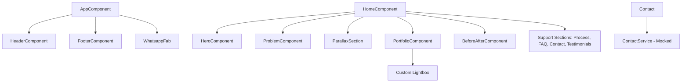

# 📝 Registro de Desenvolvimento — 10/05/2026

**Escopo:** Landing Page Principal (Home Journey)
**Commits gerados:** 8
**Arquivos modificados:** ~45

---

## 1. Visão Geral das Alterações

> Implementação completa da Landing Page para o Estúdio de Renders 3D, seguindo a estratégia de "Story-Driven Journey". A sessão focou em transformar a planta técnica em um portfólio emocional de alto impacto, garantindo performance (WebP, preloads) e acessibilidade (WCAG AA).

---

## 2. Arquitetura Afetada

---

## 3. Mapa de Arquivos Modificados

| Arquivo                                     | Tipo      | O que mudou                                |
| ------------------------------------------- | --------- | ------------------------------------------ |
| `frontend/src/app/features/home/home.ts`    | Component | Orquestrador principal das seções.         |
| `frontend/src/app/features/home/sections/*` | Component | Implementação de cada bloco narrativo.     |
| `frontend/src/app/shared/components/*`      | Component | UI reutilizável (SectionTitle, Parallax).  |
| `frontend/src/index.html`                   | HTML      | SEO, Fonts e preloads de imagem.           |
| `frontend/tailwind.config.js`               | Config    | Tokens de cor 'brand-accent' e 'brand-bg'. |

---

## 4. Detalhamento por Commit

### `feat(home): implementa o gancho narrativo`

**Razão da alteração:** Necessidade de capturar a atenção do arquiteto logo no landing.
**O que faz agora:** Apresenta o contraste entre o técnico (planta) e o emocional (render).
**Arquivos envolvidos:** `hero.ts`, `problem.ts`, `before-after.ts`.

### `feat(home): adiciona portfólio orgânico`

**Razão da alteração:** Provar a qualidade técnica através de exemplos reais.
**O que faz agora:** Exibe grid de imagens com filtros e zoom (lightbox).

---

## 5. ✅ O Que Está Funcionando

- [x] Navegação por âncoras suave.
- [x] Filtros dinâmicos no portfólio (Signals).
- [x] Slider interativo antes/depois.
- [x] Responsividade mobile-first completa.
- [x] Metatags de SEO e Open Graph.

---

## 6. ❌ O Que Está Pendente

- `[ ]` Integração real do formulário — _Simulado com `setTimeout` por enquanto._
- `[ ]` Deploy real no Firebase — _Aguardando credenciais de ambiente de prod._

---

## 7. ⚠️ Dívida Técnica Identificada

- **PrimeNG Customization:** Alguns estilos de accordion foram feitos via `::ng-deep`, o que pode ser refatorado para temas globais futuramente.
- **Image Assets:** Uso de placeholders do Unsplash; devem ser substituídos por WebPs reais do cliente.

---

## 8. Padrões Importantes a Lembrar

- **Signals:** Todos os estados reativos de UI devem usar `signal` ou `computed`.
- **Spacing:** Usar `py-32` para seções para manter o "respiro visual" da galeria.

---

## 9. Próximos Passos

1. Configurar CI/CD com GitHub Actions para o Firebase Hosting.
2. Implementar `ContactService` com EmailJS ou endpoint FastAPI real.
3. Rodar auditoria final de Lighthouse em dispositivo mobile físico.
