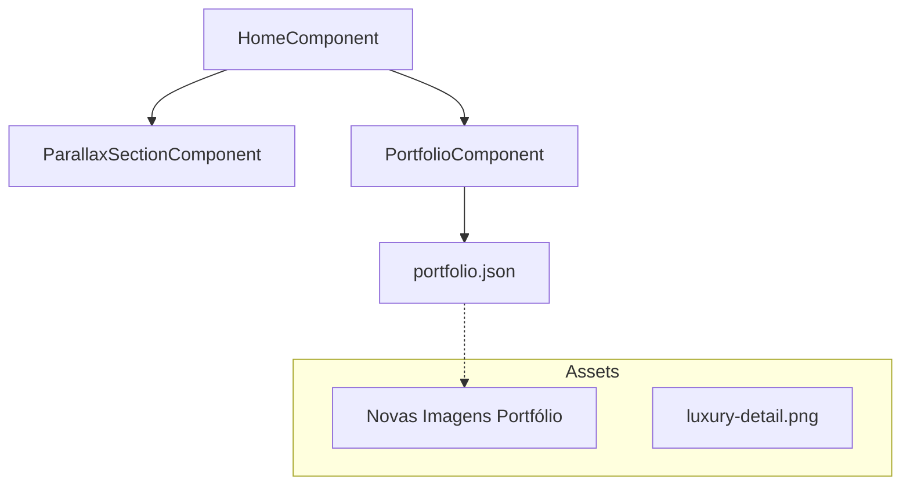

# 📝 Registro de Desenvolvimento — 10/05/2026

**Escopo:** Expansão de Portfólio e Refino de Layout
**Commits gerados:** 4
**Arquivos modificados:** 12

---

## 1. Visão Geral das Alterações

> Expansão da base de dados do portfólio com 6 novos itens e seus respectivos assets de alta fidelidade. O layout do grid foi otimizado para um preenchimento mais orgânico (denso) e uma nova seção de parallax foi adicionada para reforçar a autoridade técnica do estúdio. A seção de contato foi desativada temporariamente na orquestração.

---

## 2. Arquitetura Afetada

---

## 3. Mapa de Arquivos Modificados

| Arquivo | Tipo | O que mudou |
|--------|------|-------------|
| `frontend/public/assets/data/portfolio.json` | JSON | Adição de 6 novos itens de portfólio. |
| `frontend/src/app/features/home/home.ts` | Component | Nova seção parallax e remoção do contato. |
| `frontend/src/app/features/home/sections/portfolio/portfolio.html` | HTML | Adição de `grid-flow-dense` no grid. |
| `frontend/src/app/features/home/sections/contact/contact.html` | HTML | Conteúdo comentado (desativado). |

---

## 4. Detalhamento por Commit

### `feat(portfolio): expande base de dados e assets do portfólio`
**Razão da alteração:** Necessidade de um showcase mais robusto e variado.
**O que faz agora:** Dobra o número de itens disponíveis no portfólio, cobrindo interiores e exteriores.

### `style(portfolio): otimiza grid orgânico com fluxo denso`
**Razão da alteração:** Itens de diferentes tamanhos estavam deixando "buracos" no layout irregular.
**O que faz agora:** O grid tenta preencher todos os espaços vazios automaticamente.

### `feat(home): adiciona seção parallax e desativa temporariamente contato`
**Razão da alteração:** Reforçar o impacto visual e preparar para re-trabalho no formulário.
**O que faz agora:** Exibe uma transição imersiva entre FAQ e o fim da página.

---

## 5. ✅ O Que Está Funcionando

- [x] Portfólio com 12 itens e filtros ativos.
- [x] Layout irregular preenchido (dense flow).
- [x] Seções de parallax com assets locais.

---

## 6. ❌ O Que Está Pendente

- `[ ]` Reativação do formulário de contato — *HTML comentado e import removido.*

---

## 7. ⚠️ Dívida Técnica Identificada

- **Inconsistência de Orquestração:** A remoção do `ContactComponent` da Home quebrou o fluxo narrativo planejado; deve ser restaurado.

---

## 8. Padrões Importantes a Lembrar

- **Grid Denso:** Ao adicionar itens ao portfólio, manter a lógica de `col-span` e `row-span` para manter o ritmo visual.

---

## 9. Próximos Passos

1. Restaurar e validar o `ContactComponent`.
2. Otimizar os novos assets de imagem para WebP (atualmente PNGs).

---

## 10. Validações Mapeadas

| Campo / Função | Regra de validação | Status |
|---------------|-------------------|--------|
| Grid Flow | Sem espaços vazios no desktop | ✅ |
| Filtros Portfólio | Atualiza lista via Signal | ✅ |
| Assets Imagem | Caminhos relativos corretos | ✅ |
