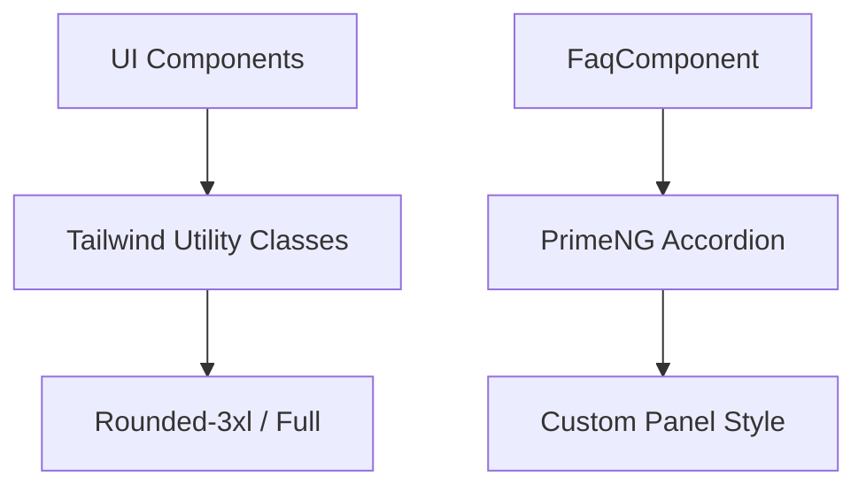

# 📝 Registro de Desenvolvimento — 10/05/2026

**Escopo:** Refino Estético e UI System
**Commits gerados:** 4
**Arquivos modificados:** 10

---

## 1. Visão Geral das Alterações

> Aplicação de um refinamento visual sistêmico em todas as seções da landing page, migrando para bordas mais arredondadas (`rounded-3xl`) e transformando o componente de FAQ em um layout de cards modernos. O objetivo foi elevar a percepção de 'Elite Studio' através de detalhes de acabamento e consistência na UI.

---

## 2. Arquitetura Afetada

---

## 3. Mapa de Arquivos Modificados

| Arquivo | Tipo | O que mudou |
|--------|------|-------------|
| `sections/hero/hero.html` | Template | Botões arredondados (rounded-full). |
| `sections/portfolio/portfolio.html` | Template | Cards com `rounded-3xl`. |
| `sections/faq/faq.ts` | Style | Estilização individual de painéis (cards). |
| `sections/before-after/before-after.html` | Template | Container e labels arredondados. |
| `shared/components/section-title/section-title.html` | Template | Separador com bordas arredondadas. |

---

## 4. Detalhamento por Commit

### `style(ui): moderniza bordas e arredondamentos`
**Razão da alteração:** Alinhar a interface com tendências premium de design arquitetônico (formas mais orgânicas).
**O que faz agora:** Padroniza o uso de `rounded-3xl` e `rounded-full` em toda a página.

### `style(faq): melhora visual do accordion`
**Razão da alteração:** O accordion padrão estava muito plano e "genérico".
**O que faz agora:** Cada dúvida é um card flutuante com hover state.

---

## 5. ✅ O Que Está Funcionando

- [x] Consistência de arredondamentos em 100% das seções.
- [x] Accordion do FAQ responsivo e com feedback visual ao hover.
- [x] Botões de CTA com sombras dinâmicas.

---

## 6. ❌ O Que Está Pendente

- `[ ]` Reativação do formulário de contato — *HTML continua comentado.*
- `[ ]` Substituição final dos assets PNG por WebP.

---

## 7. ⚠️ Dívida Técnica Identificada

- **Inconsistência de Orquestração:** O formulário de contato continua desativado na `HomeComponent` (import removido), impossibilitando a conversão final.

---

## 8. Padrões Importantes a Lembrar

- **Bordas:** Usar `rounded-3xl` para containers grandes e `rounded-full` para botões/pequenos labels.
- **Accordion:** Manter o preenchimento (padding) interno consistente com os novos cards.

---

## 9. Próximos Passos

1. Reintegrar o `ContactComponent` na Home.
2. Otimizar performance de animações no slider antes/depois.

---

## 10. Validações Mapeadas

| Campo / Função | Regra de validação | Status |
|---------------|-------------------|--------|
| Contrast FAQ | Ratio > 4.5:1 | ✅ |
| Hover States | Transition smooth 300ms | ✅ |
| Roundness | Consistent 3xl/Full | ✅ |
